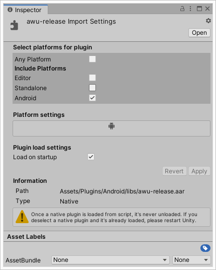

# awu - Android Wrapper for Unity

This is an Android's _library_ that is designed to be used as a plugin within Unity's project. It is created using Android Studio 3.6 and should consist of all projects files required by the IDE if one desires to tweak its functionality to his or hers needs.

The main purpose of this _library_ is to allow the user to retreive platform related information within Unity's project and currently includes:

- retreiving information regarding the state of the network via `isNetworkAvailable`
- determining if a device on which the app is running is of Tv-type via `isAndroidTv`

## How to integrate

1. Clone _awu_ repository and build the _library_ using Android Studio yourself or use the latest _.aar library_ release from [here](awu/build/outputs/aar/awu-release.aar)

2. Copy the _.aar library_ file into your Unity's project _Assets/Plugins/Android_ directory

3. _(Optional)_ In Unity select the _.aar library_ file from Project window and check the option __Load on startup__ from the Inspector

<p align="center"></p> 

4. Copy Unity's C# implementation available from [here](UnityScript/Awu.cs) into your _Assets/Scripts_

## Usage

Upon finishing the integration process described above you should be able to take advantage of _library's_ functionality.<br>
In your C# Unity's code you can use it in the following way:

```
bool isNetAvailable = Awu.IsNetworkAvailable;
bool itTv = Awu.IsAndroidTv;
// ...
```

## Copyright and License
Copyright 2005-2020 Rixment. Code released under the [MIT](./LICENSE) license.
